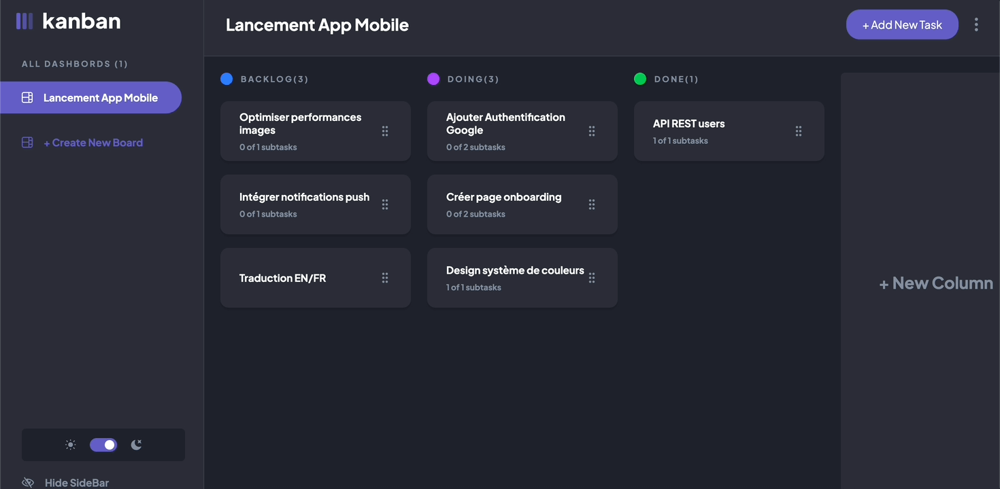
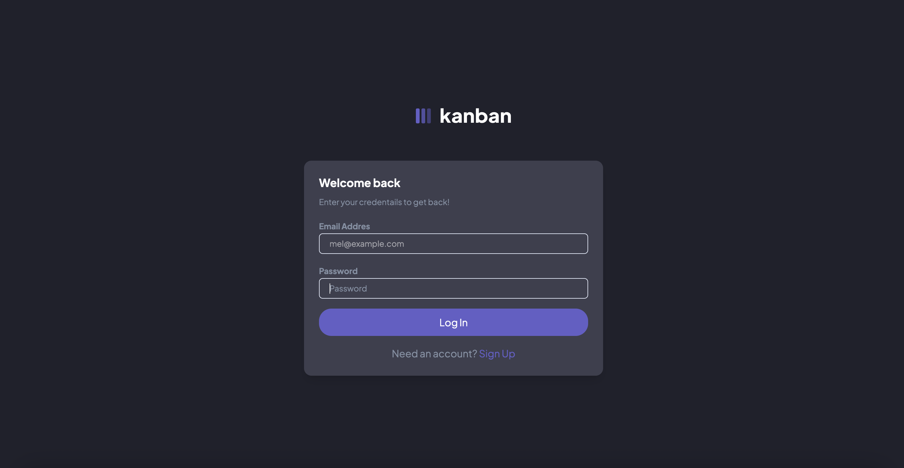
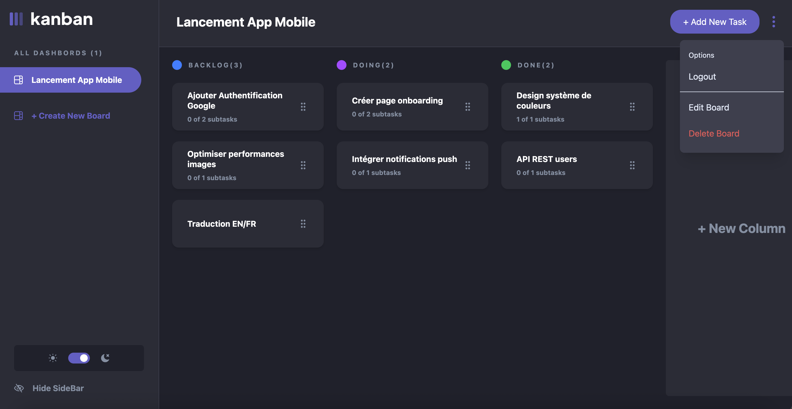
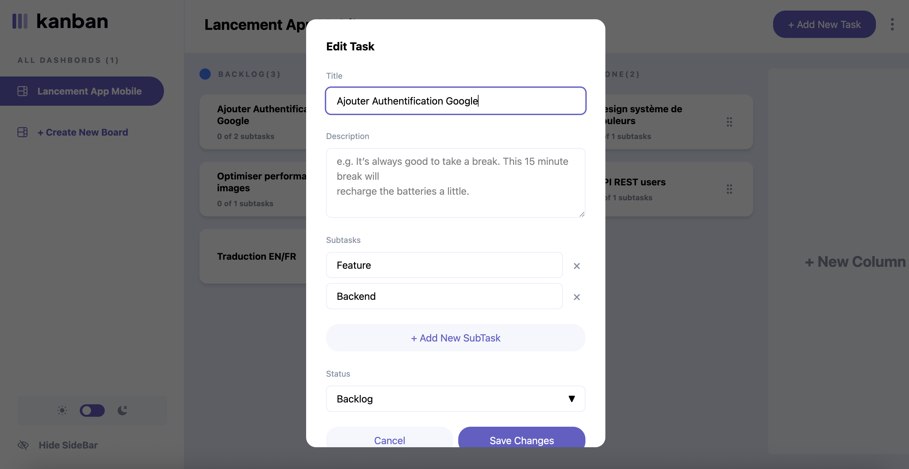
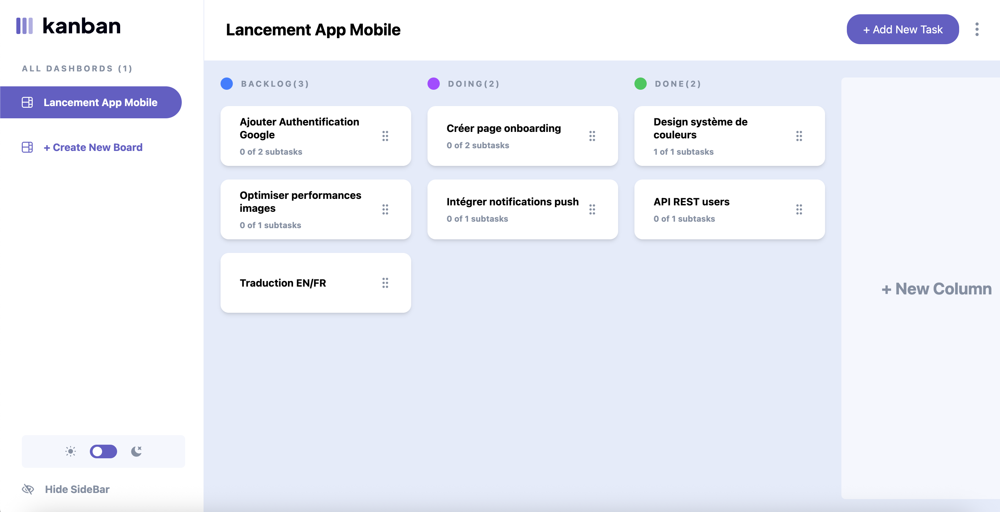
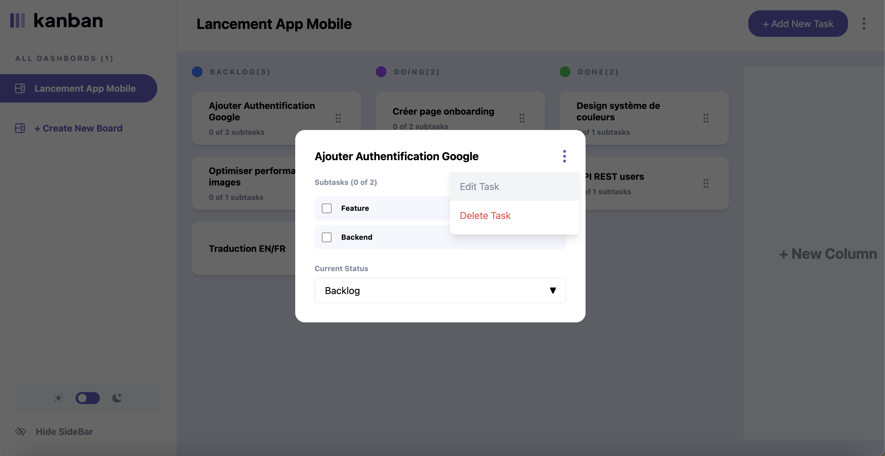
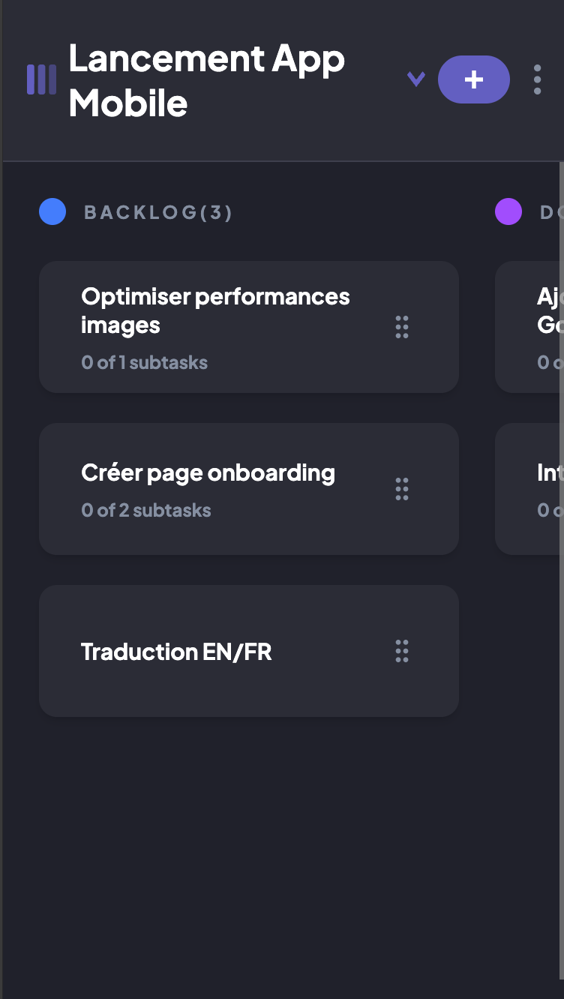
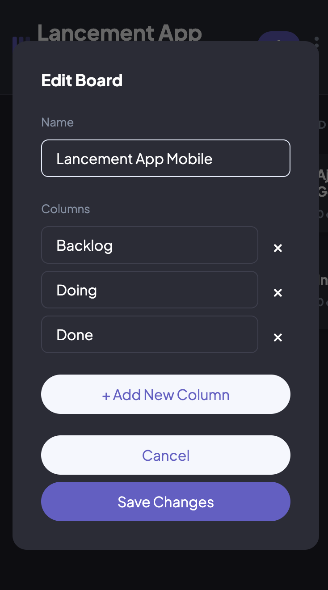
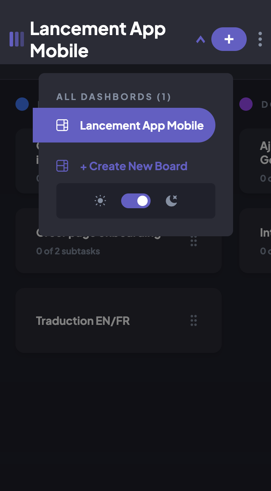

# Kanban task management web app 

This Kanban task management web application with authentication system, 
allowing you to create and organize projects via drag & drop. Inspired by the 
[Kanban task management web app challenge on Frontend Mentor](https://www.frontendmentor.io/challenges/kanban-task-management-web-app-wgQLt-HlbB), enhanced with Firebase for data persistence.

## Table of contents

- [Overview](#overview)
- [Demo & Screenshots](#demo)
- [Tech Stack](#tech-stack)
- [Features](#features)
- [Links](#links)

## Overview

### The challenge

This project is a solution to the Kanban task management web app challenge on Frontend Mentor. The goal was to build a fully functional task management application with CRUD operations for boards, columns, tasks, and subtasks.

## 🎬 Demo & Screenshots

### Demo

### 💻 Desktop Views

  
  
  

  
  

### 📱 Mobile Version

  
  
  

## 🛠️ Tech Stack 

- **Frontend:** React + Tailwind CSS
- **Backend:** Firebase (Authentication + Firestore)
- **Fonctionnalités:** Drag & Drop, Dark Mode, Responsive Design

## ✨ Features

- 🔐 **Complete Authentication System** with Firebase
- 📋 **Board Management** - Create, edit, and delete boards
- 📊 **Customizable Columns** - Flexible workflow organization
- ✅ **Tasks & Subtasks** - Full task management with subtasks
- 🎨 **Dark/Light Mode** - Adaptive theme switching
- 📱 **Fully Responsive** - Optimized for mobile and desktop
- 🖱️ **Drag & Drop** - Intuitive card movement between columns

## 🔗 Links

- 🌐 **Live Demo:** [View Application](https://kanban-app-mcrzx.vercel.app/login) 
- 💻 **Source Code:** [GitHub Repository](https://github.com/Melaniecrzx/Kanban-App.git) 
- 🎯 **Challenge:** [Frontend Mentor](https://www.frontendmentor.io/challenges/kanban-task-management-web-app-wgQLt-HlbB)

## 💡 What I Learned

- Implementing drag & drop functionality in React
- Managing complex nested state with multiple data levels
- Structuring an optimized Firestore database
- Handling authentication and user data with Firebase

## 👤 Author

- GitHub - [@Melaniecrzx](https://github.com/Melaniecrzx) 

